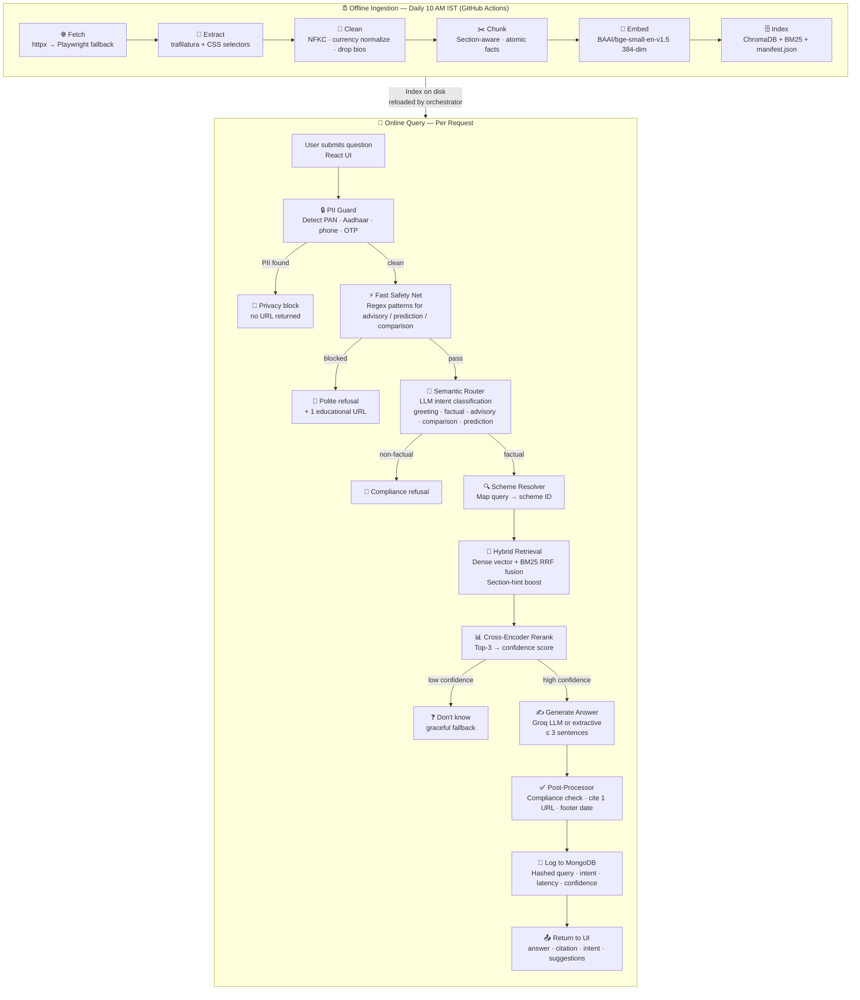

# Groww FinQuery — HDFC Mutual Fund FAQ Assistant

> **Facts-only. No investment advice. No PII stored.**

Groww FinQuery is a conversational AI assistant that answers factual questions about HDFC mutual fund schemes using only verified, source-cited data scraped from Groww product pages. It is built on a Retrieval-Augmented Generation (RAG) architecture with a strict compliance layer that prevents advisory, comparative, or speculative responses.

---

## What it does

Users ask natural-language questions like *"What is the exit load of HDFC Mid Cap Fund?"* and receive a concise, source-cited factual answer in seconds. The assistant:

- Answers questions about **expense ratios, exit loads, risk levels, lock-in periods, SIP minimums, benchmarks, and fund managers**
- Refuses to give **investment advice, performance predictions, or fund comparisons**
- **Redacts PII** (Aadhaar, PAN, phone numbers, OTPs) before any processing
- Always cites its source URL and shows the data freshness date
- Surfaces follow-up suggestions after each answer

---

## Covered Schemes (Closed Corpus)

The assistant only answers questions about these 5 HDFC schemes on Groww. Any question outside this corpus returns *"I don't have a verified answer."*

| # | Scheme | Category |
|---|--------|----------|
| 1 | HDFC Mid Cap Fund — Direct Growth | Mid Cap |
| 2 | HDFC Equity Fund — Direct Growth | Flexi Cap |
| 3 | HDFC Focused Fund — Direct Growth | Focused |
| 4 | HDFC ELSS Tax Saver — Direct Plan Growth | ELSS |
| 5 | HDFC Large Cap Fund — Direct Growth | Large Cap |

---

## How It Works



### Key Design Decisions

| Decision | Rationale |
|----------|-----------|
| **Closed corpus (5 URLs only)** | Eliminates hallucination risk; answers are always traceable to a specific Groww page |
| **Dual retrieval: dense + BM25** | Dense embeddings handle paraphrase; BM25 catches exact fund-name / numerical matches. RRF fusion avoids score normalization issues |
| **Cross-encoder reranker** | Improves precision over bi-encoder alone; confidence margin gates graceful fallbacks |
| **LLM for intent routing, extractive for facts** | Groq LLM writes warmer answers; but extraction is the fallback, keeping the system functional without an API key |
| **PII guard runs first** | Before any LLM call, preventing accidental logging or echoing of sensitive data |
| **Post-processor compliance check** | Enforces ≤ 3 sentences, exactly 1 whitelisted URL, no banned advisory tokens — programmatically, not just by prompt |
| **Daily refresh via GitHub Actions** | Keeps data fresh without manual intervention; drift detection freezes the index if ≥ 2 schemes change simultaneously |
| **MongoDB audit log** | Stores hashed queries (never raw) + intent + latency + confidence for monitoring without storing PII |

---

## Compliance Gates

The system has **three independent layers** that prevent policy violations:

1. **PII Guard** — Regex detects PAN, Aadhaar, phone, OTP patterns. Fires before any LLM call.
2. **Fast Regex Safety Net** — Pattern-matches known advisory / prediction / comparison phrases before the LLM router runs.
3. **Post-Processor Check** — After generation, validates sentence count, URL whitelist, and absence of banned tokens (`recommend`, `better than`, `will grow`, etc.).

The CI compliance gate (`test_eval`) enforces:
- Factual answer rate ≥ 70%
- Refusal / PII / don't-know rates = 100%
- All cited URLs in `config/sources.yaml`
- Factual answers ≤ 3 sentences
- Zero advisory tokens in any answer

---

## API Reference

| Method | Endpoint | Description |
|--------|----------|-------------|
| `GET` | `/api/health` | Liveness check + index status |
| `GET` | `/api/meta` | AMC, schemes, chunk count, last refresh timestamp |
| `GET` | `/api/examples` | Three example factual questions |
| `POST` | `/api/ask` | `{ "query": "...", "session_id": "..." }` → answer + citation + intent |
| `POST` | `/api/reingest` | Trigger a corpus refresh in the background |
| `GET` | `/api/refresh-status` | Last refresh log entry |

**`/api/ask` response fields:**

| Field | Type | Description |
|-------|------|-------------|
| `answer` | string | Full formatted answer with footer |
| `body` | string | Answer body only (no footer) |
| `citation_url` | string | Source Groww URL |
| `intent` | string | `factual` · `advisory` · `comparison` · `prediction` · `pii` · `dont_know` · `greeting` |
| `confidence` | float | Cross-encoder top score |
| `margin` | float | Score gap between rank-1 and rank-2 |
| `suggestions` | string[] | Follow-up question chips |
| `latency_ms` | int | End-to-end latency |

---

## Local Setup

### Backend

```bash
cd backend
python -m venv .venv && source .venv/bin/activate

# CPU-only PyTorch keeps the install under 1 GB
pip install --no-cache-dir torch==2.5.1 --index-url https://download.pytorch.org/whl/cpu
pip install -r requirements.txt
python -m playwright install chromium

cp .env.example .env   # add GROQ_API_KEY for LLM-generated answers (optional)
```

Build the index for the first time:

```bash
python -c "from mf_faq.ingestion.pipeline import refresh; print(refresh(force=True).to_dict())"
```

Run the API server:

```bash
uvicorn server:app --host 0.0.0.0 --port 8001
```

### Frontend

```bash
cd frontend
yarn install
yarn start   # http://localhost:3000
```

---

## Automated Corpus Refresh

The index is rebuilt daily at **10:00 AM IST (04:30 UTC)** via GitHub Actions (`.github/workflows/ingest.yml`).

**Manual trigger:** Actions → *Refresh Mutual Fund FAQ Corpus* → Run workflow

**Local trigger:**
```bash
curl -X POST http://localhost:8001/api/reingest
```

**Drift detection:** If ≥ 2 schemes' content hashes change in the same refresh window, the pipeline freezes the existing index rather than overwriting it — protecting against Groww page restructuring or scraping anomalies. Use `force=True` to override.

---

## Deployment

| Layer | Recommended Hosts | Required Environment Variables |
|-------|------------------|-------------------------------|
| **Backend** | Railway · Fly.io · any Docker host | `MONGO_URL`, `DB_NAME`, `CORS_ORIGINS`, `GROQ_API_KEY` (optional) |
| **Frontend** | Vercel · Netlify | `REACT_APP_BACKEND_URL` |
| **Index persistence** | Add a GitHub Actions step to push `backend/data/index/` to a release branch or object storage after each refresh | — |

A `Dockerfile` is provided at the project root for containerised deployment.

---

## Known Limitations

| Limitation | Impact |
|------------|--------|
| Corpus limited to 5 Groww product pages | Statement downloads, capital gains walkthroughs, and other help-page content returns *"I don't have a verified answer"* |
| Performance / return computations refused | Redirects to the official scheme page instead |
| Embeddings run locally (`BAAI/bge-small-en-v1.5`) | The Groq API key does not support `/v1/embeddings`; local inference adds ~100–300 ms on cold start |
| Groq LLM is opt-in | Without `GROQ_API_KEY` the system answers extractively — still source-cited and policy-compliant |
| Riskometer extraction depends on Groww's text label | If Groww switches to image-only risk labels, riskometer answers will degrade until the extractor is updated |

---

## Running Tests

```bash
cd backend
python -m tests.test_core    # Integration: ingestion + retrieval + orchestrator
python -m tests.test_eval    # CI compliance gate: factual · refusal · PII
```

The `test_eval` suite is the **CI compliance gate** and must pass before any deployment.
